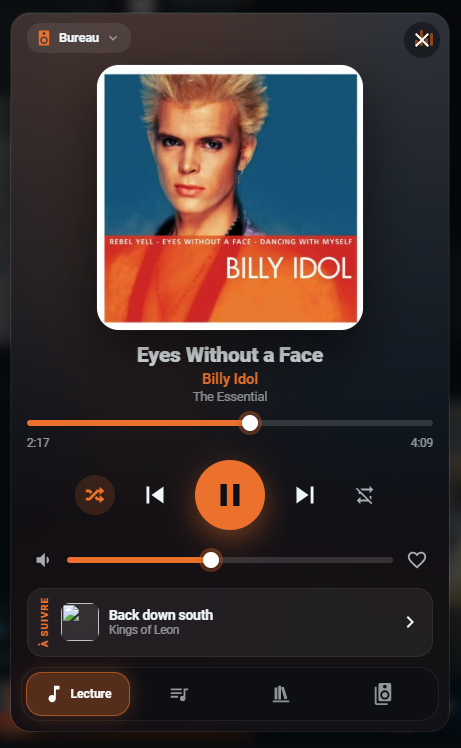
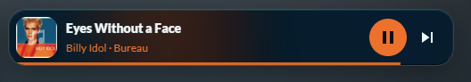
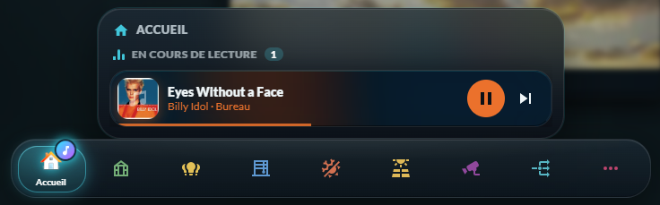

# 🎵 HOLM Music Card

[](https://hacs.xyz/)


**Un lecteur Music Assistant moderne pour Home Assistant : la pochette en grand, les couleurs qui suivent la musique, votre bibliothèque et toutes vos enceintes dans une seule carte.**

HOLM Music Card exploite **toutes les possibilités de [Music Assistant](https://music-assistant.io/)** : lecture en cours, file d'attente, bibliothèque complète avec recherche sur tous vos services, radios, podcasts, multiroom… Le fond et la couleur d'accent sont **tirés de la pochette**, les gestes sont naturels (glisser pour changer de titre, double-toucher pour ajouter aux favoris), et une **vue mini** permet de l'intégrer dans une barre ou un coin de tableau de bord.

> ✨ **Zéro YAML.** On ajoute la carte depuis le sélecteur de cartes, on choisit son lecteur, et **tous les réglages se font dans l'éditeur visuel**.

### En bref

- 🎨 **Lecture en cours** : pochette carrée ou **vinyle qui tourne**, fond flouté et couleur d'accent **extraits de la pochette**, titres longs qui défilent, barre de progression interactive, aléatoire, répétition, favori, volume.
- 👆 **Gestes** : glisser sur la pochette = titre suivant / précédent, double-toucher = favori ♥.
- 📜 **File d'attente** : titre en cours et suivants, lecture d'un titre, déplacement, « lire ensuite », suppression, vider la file, **enregistrer comme playlist**.
- 📚 **Bibliothèque** : accueil (écoutés récemment, favoris, ajouts récents), playlists, albums, artistes, titres, radios, podcasts, livres audio ; tris, filtre favoris, fiches album / artiste / playlist.
- 🔎 **Recherche globale**, dans votre bibliothèque **et** sur vos services de streaming.
- ▶️ **Lire maintenant, ensuite, ajouter à la file, remplacer**, ou lancer un **mode radio** (titres similaires).
- 🔊 **Enceintes** : changer de lecteur, **transférer la lecture** d'une pièce à l'autre, **regrouper** (multiroom), volume par enceinte.
- 🪟 **Vue mini** : une barre compacte ; un toucher ouvre le lecteur complet en fenêtre.
- 🧭 Utilisée par **[HOLM Navbar Card](https://github.com/kaaribou/holm-navbar-card)** pour le mini lecteur, la note de musique et les lecteurs en cours.

| Lecture en cours | Vue mini et lecteurs en cours (avec HOLM Navbar Card) |
|---|---|
|  | <br><br> |

---

## Sommaire

- [Prérequis](#prérequis)
- [Installation](#installation)
- [Configuration](#configuration)
- [File d'attente complète (connexion directe)](#file-dattente-complète-connexion-directe)
- [Pochettes](#pochettes)
- [Utilisation avec HOLM Navbar Card](#utilisation-avec-holm-navbar-card)
- [Exemples YAML](#exemples-yaml)
- [FAQ / dépannage](#faq--dépannage)

---

## Prérequis

> [!IMPORTANT]
> Cette carte est un lecteur **pour Music Assistant uniquement**. Il faut :
> - un serveur **[Music Assistant](https://music-assistant.io/) 2.x** (module complémentaire ou conteneur) ;
> - l'intégration **Music Assistant** installée dans Home Assistant (Paramètres → Appareils et services) ;
> - **Home Assistant 2025.1** ou plus récent.
>
> Les lecteurs proposés sont les entités `media_player` créées par l'intégration Music Assistant.

---

## Installation

### Avec HACS (recommandé)

1. HACS → menu ⋮ → **Dépôts personnalisés**.
2. Ajoutez `https://github.com/kaaribou/holm-music-card`, catégorie **Tableau de bord** (*Dashboard / Plugin*).
3. Recherchez **HOLM Music Card** → **Télécharger**.
4. Rechargez la page (Ctrl + F5).

### Manuellement

1. Copiez `dist/holm-music-card.js` dans `config/www/community/holm-music-card/`.
2. **Paramètres → Tableaux de bord → ⋮ → Ressources → Ajouter** : `/local/community/holm-music-card/holm-music-card.js`, type **Module JavaScript**.
3. Rechargez la page.

---

## Configuration

Ajoutez la carte **HOLM Musique** depuis le sélecteur de cartes, choisissez votre lecteur : c'est prêt. Tout le reste se règle dans l'éditeur.

| Option | Description | Par défaut |
|---|---|---|
| `entity` | Lecteur Music Assistant (**obligatoire**) | — |
| `mode` | `full` (complet) ou `mini` (barre compacte) | `full` |
| `artwork` | `square` (pochette) ou `vinyl` (vinyle qui tourne) | `square` |
| `start_tab` | Onglet à l'ouverture : `now`, `queue`, `library`, `speakers` | `now` |
| `dynamic_color` | Couleurs tirées de la pochette | `true` |
| `accent` | Couleur d'accent (si couleurs dynamiques désactivées ou sans pochette) | `#26c6da` |
| `height` | Hauteur de la carte complète (px) | `640` |
| `library_types` | Rubriques de la bibliothèque : `home`, `playlist`, `album`, `artist`, `track`, `radio`, `podcast`, `audiobook` | `home, playlist, album, artist, track, radio` |
| `show_players` | Onglet **Enceintes** | `true` |
| `players` | Lecteurs proposés (vide = tous ceux de Music Assistant) | tous |
| `ma_url` / `ma_token` | Connexion directe à Music Assistant (voir ci-dessous) | — |
| `ma_image_url` | Adresse HTTPS des images, si Music Assistant n'est pas l'add-on (voir [Pochettes](#pochettes)) | — |

---

## File d'attente complète (connexion directe)

Par défaut, la carte passe **uniquement par Home Assistant** : la file d'attente montre le titre en cours et le suivant.

Pour afficher **toute la file** et pouvoir la réorganiser (déplacer, lire ensuite, supprimer, vider, enregistrer comme playlist), renseignez dans **Connexion directe à Music Assistant** :

- **URL** : l'adresse de votre serveur Music Assistant, par exemple `http://192.168.1.10:8095` ;
- **Jeton** : un jeton d'accès (*token*) créé dans Music Assistant.

La connexion est partagée par toutes les cartes de la page (il suffit de la renseigner une fois).

> 🔒 Le jeton est stocké dans la configuration du tableau de bord : ne le renseignez que sur un dashboard réservé à votre foyer.

---

## Pochettes

Music Assistant fournit les pochettes depuis son propre serveur (par exemple `http://192.168.1.10:8095/imageproxy/…`). Un navigateur ne peut pas les afficher quand Home Assistant est ouvert en **HTTPS** ou **depuis l'extérieur**.

- **Avec l'add-on Music Assistant** (Home Assistant OS / Supervised) : rien à faire, la carte fait passer automatiquement les images par Home Assistant (ingress de l'add-on).
- **Serveur Music Assistant séparé** (Docker, autre machine) : renseignez dans **Pochettes (avancé)** l'adresse HTTPS de votre serveur Music Assistant joignable par le navigateur (`ma_image_url`).

---

## Utilisation avec HOLM Navbar Card

**[HOLM Navbar Card](https://github.com/kaaribou/holm-navbar-card)** utilise ce lecteur pour :

- le **mini lecteur** au-dessus de la barre de navigation ;
- la **note de musique** animée sur un onglet quand un lecteur joue ;
- le panneau **« En cours de lecture »** à l'appui long (un mini lecteur par enceinte).

👉 Si vous utilisez ces fonctions de la barre, **HOLM Music Card doit être installée**.


---

## Exemples YAML

```yaml
# Lecteur complet
type: custom:holm-music-card
entity: media_player.salon
artwork: vinyl
height: 680
```

```yaml
# Vue mini
type: custom:holm-music-card
entity: media_player.salon
mode: mini
```

```yaml
# Bibliothèque sur mesure, lecteurs limités
type: custom:holm-music-card
entity: media_player.salon
start_tab: library
library_types: [home, playlist, album, radio, podcast]
players: [media_player.salon, media_player.cuisine, media_player.bureau]
```

---

## FAQ / dépannage

| Problème | Solution |
|---|---|
| Aucun lecteur proposé dans l'éditeur | L'intégration **Music Assistant** doit être installée dans Home Assistant ; seuls ses lecteurs sont proposés. |
| La file ne montre que 2 titres | Normal sans connexion directe : renseignez l'URL et le jeton Music Assistant. |
| La bibliothèque est vide | Vérifiez que Music Assistant a bien synchronisé vos services (dans l'interface de Music Assistant). |
| Le favori ne fonctionne pas | Le titre doit venir d'un service qui accepte les favoris ; avec la connexion directe, l'ajout passe par Music Assistant. |
| Pas de pochettes (carrés vides) | Avec l'add-on : rechargez la page. Sans l'add-on : renseignez `ma_image_url` (voir [Pochettes](#pochettes)). |
| La nouvelle version ne s'affiche pas | Videz le cache (Ctrl + F5, ou « Recharger les ressources » dans l'application mobile). |

---

## Un petit merci ?

Le lecteur vous plaît ? Vous pouvez m'offrir une bière 🍺

[](https://paypal.me/kaaribou)

---

## Licence

Code sous licence **MIT** — © kaaribou. Voir le [CHANGELOG](CHANGELOG.md).
Music Assistant est un projet indépendant ([music-assistant.io](https://music-assistant.io/)).

Fait partie de la collection **HOLM** : [HOLM Navbar Card](https://github.com/kaaribou/holm-navbar-card) · [Carburant HOLM](https://github.com/kaaribou/carburant-holm).
